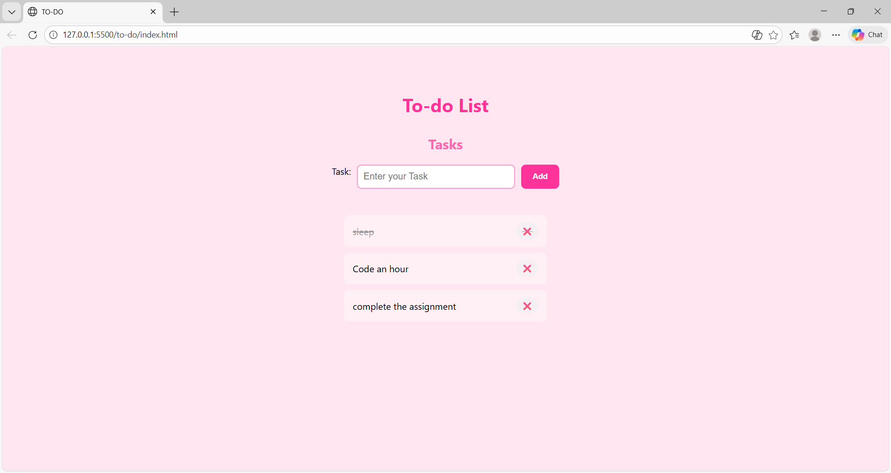

# To-Do List (Vanilla JavaScript)

A clean and interactive To-Do List application built using **HTML, CSS, and Vanilla JavaScript**.  
This project helps users manage daily tasks with a simple and user-friendly interface.

---

## ✨ Features
- Add new tasks
- Delete tasks
- Mark tasks as completed
- Tasks persist using **localStorage**
- Clean pink-themed UI
- Responsive design

---

## 🛠 Technologies Used
- HTML5
- CSS3
- JavaScript (DOM Manipulation, Events, localStorage)

---

## 📚 What I Learned
- Handling DOM elements using JavaScript
- Using event listeners (`submit`, `click`)
- Dynamically creating and removing elements
- Storing and retrieving data using localStorage
- Basic UI styling and responsive design

---

## 🚀 How to Run
1. Clone the repository  
2. Open `index.html` in your browser  
3. Start adding your tasks!

---

## 📸 Preview

---

## 🧠 Future Improvements
- Task filtering (All / Completed / Pending)
- Smooth animations
- Drag and drop task reordering
- Edit tasks feature

---

=
